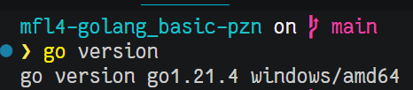
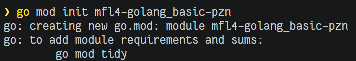
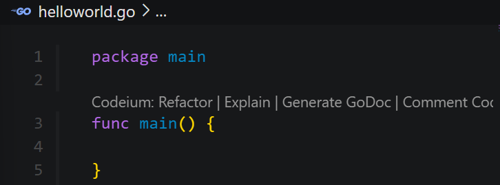
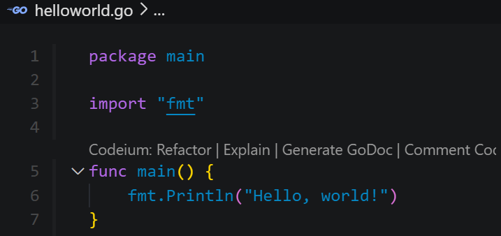
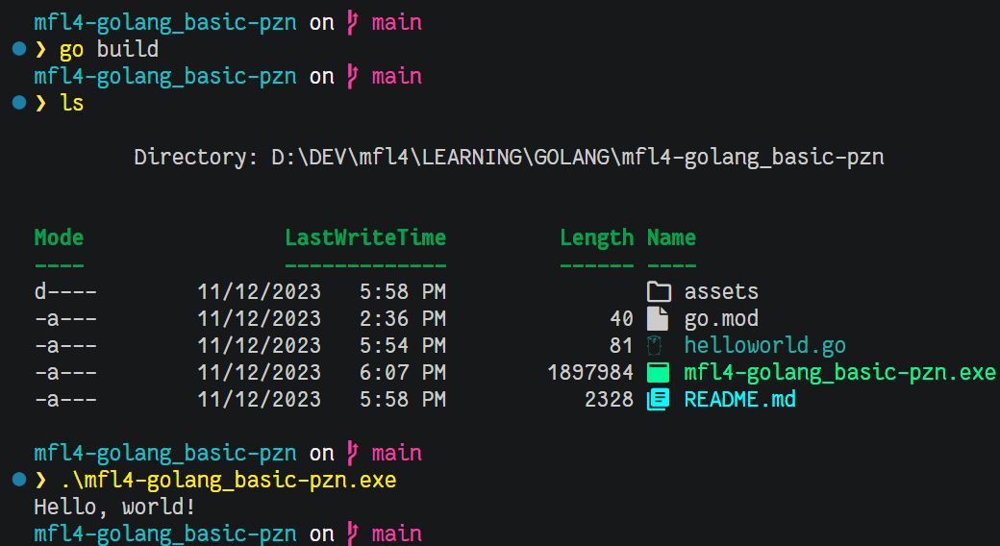
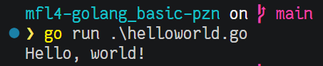
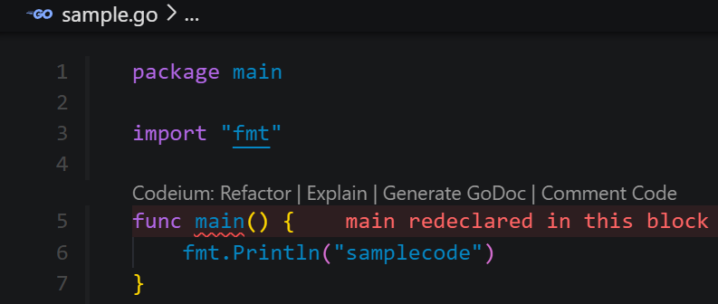
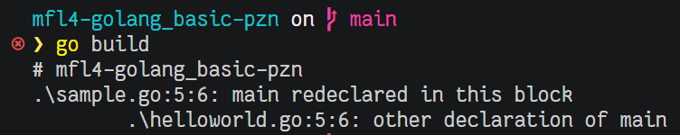
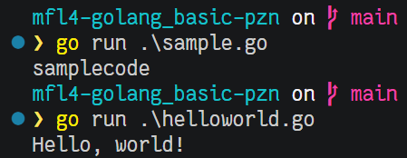

# mfl4-golang_basic-pzn
---

## Go-Lang Introduction

### History of Go-Lang
- Created at Google using the C programming language
- Released to the public as open source in 2009
- Go-Lang has been popular since it was used to build Docker in 2011 
- Nowadays, many new technologies are created using Go-Lang instead of C, such as Kubernetes, Prometheus, CockroachDB, etc.
- It is now becoming popular for creating Backend APIs in Microservices

### Why Learn Go-Lang?
- The Go-Lang language is so simple, it doesn't take long to learn.
- Go-Lang supports good concurrency programming, where we currently live in the age of multicore processors
- Go-Lang supports garbage collector, so there is no need to do memory management manually like in C language.
- One of the up-and-coming programming languages

### Go-Lang Program Development Process
- Go Compiler --Compile File--> main.go
- Go Compiler --Produce Binary File--> main

## Installing Go-Lang

### Software Development Kit
- https://golang.org/
- Download Go-Lang Compiler
- Install Go-Lang Compiler
- Check using the : go version

### Text Editor or IDE
- Visual Studio Code
- JetBrains GoLand

## Creating a Project
- Projects in Go-Lang, usually referred to as modules
- To create a module, we can use the following command in the folder where we will create the module: go mod init nama-module
- There are many features of Go-Lang Modules, but we will discuss them in a special class about Go-Lang Modules.

## Hello World program

### Main Function
- Go-Lang, it is similar to the C/C++ programming language, where there needs to be a main function.
- Main function is a function that will be executed when the program runs.
- To create a function, we can use the func keyword.
- Main function must be contained in the main package
- Semicolon in Golang, is not mandatory, meaning we can add semicolon or not, at the end of our program code.

### Println
- To write a post, we need to import the fmt module first. 
- Similar to when we learn Java
- The material about import, we will discuss in a separate section

### Go-Lang File Compilation

### Running Without Compilation

## Multiple Main Function
- In Golang, functions in a module / project are unique, meaning that we cannot create the same function name.
- Oleh karena itu, jika kita membuat file baru, misal sample.go, lalu membuat nama function yang sama yaitu main
- Maka kita tidak bisa melakukan build module, karena main function tersebut duplikat dengan yang ada di main function helloworld.go

### Sample

### Compile Error

### The solution?
- Because now we are still in the learning phase, therefore we will not build the project module first.
- Now we will focus on running the Golang files one by one, so there will be no errors if we run the files one by one.
- But REMEMBER, in reality later, when we create a project, we will only create one main function.

### Running Golang

